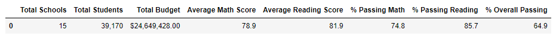
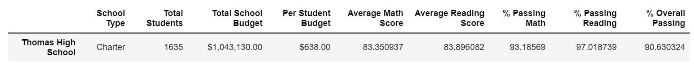

# School_District_Analysis
Analyze data on student funding and students' standardize test score to assist the school board and superintendent in making decisions regarding school budgets and priorities.
## Overview of the school district analysis
The Purpose of this analysis: Once all the analysis has completed, just rceived a notication that Thomas High School exits academic dishonesty. Thus, I have to replace the math and reading scores with Nan for all the students and re-start analysis.
## Resulte
There is a bulleted list that addresses how each of the seven school district metrics was affected by the changes in the data
Results: Using bulleted lists and images of DataFrames as support, address the following questions.

### District summary: 
Based on the 2 district summary tables below, the "% Passing Math" decreased 0.2% (from 75% to 74.8%); the "% Passing Reading" decreased 0.3% (from 86% to 85.7%); the "% Overall Passing" decreased 0.1% (from 65% to 64.9%)
New result: 

Original result: 
### School summary:
Replacing the ninth graders' math and reading scores only make Thomas High School's "% Passing Math", "% Passing Reading" and "% Overall Passing" increased, which are 66.91% to 93.19, 69.66% to 97.02% and 65% to 90.63%, but haven't affected the other schools' performance. Math and reading scores by grade, scores by school spending, by size, and by school type are kept the same for the rest of the school, except Thomas High School 9th grade don't have math and reading scores.
New result: 

Original result: 

## Summary
Overall, after reading and math scores for the ninth grade at Thomas High School have been replaced with NaNs, the "average math", "average reading", "% Passing Math", "% Passing Reading", "% Overall Passing" have been changed for the total 15 schools.
